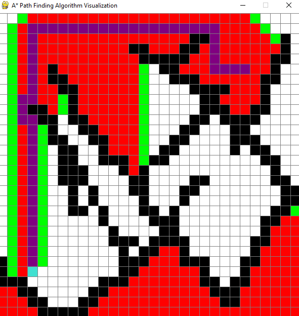

# A-star Pathfinding Algorithm visualization.

This is a small project that uses a grid with interactive maze placement to visualize how an A-star algorithm works in real time!

## Used Libraries
**PyGame**, Math, Queue

## How to use?

• First off, you should place the start and the end nodes on the grid using the left mouse button.

• Press the left mouse button as well after that to place barriers/draw your maze

• You can delete/erase a specific node by right clicking on it (inculding the start and end node)

• When you are done constructing your map hit the **SPACE** button!

• Once the algorithm is done and figured the solution you can go again by clearing the canvas by hitting **C**

## Preview




## Color legend

• White, clear node (walkable)

• Black, barrier (un-walkable)

• Red, visited nodes

• Green, calculated nodes

• Orange, start node

• Turquoise, end node

• Purple, shortest path (solution)

## Clone the project

```
$ git clone https://github.com/naser-da/A-star
```